# 🔍 Kiuwan SAST Pipeline - Análisis de Código Estático Automatizado


Pipeline automatizado de **Static Application Security Testing (SAST)** integrado con **Kiuwan** mediante GitHub Actions. Este proyecto demuestra la integración de análisis de seguridad estático en workflows de CI/CD utilizando código intencionalmente vulnerable para testing.

## 📋 Tabla de Contenidos

- [Descripción General](#-descripción-general)
- [Características](#-características)
- [Cómo Funciona](#-cómo-funciona)
- [Arquitectura del Proyecto](#-arquitectura-del-proyecto)
- [Código Vulnerable de Ejemplo](#-código-vulnerable-de-ejemplo)
- [Requisitos Previos](#-requisitos-previos)
- [Configuración](#-configuración)
- [Uso](#-uso)
- [Resultados del Análisis](#-resultados-del-análisis)
- [Tecnologías Utilizadas](#️-tecnologías-utilizadas)
- [Vulnerabilidades Detectadas](#-vulnerabilidades-detectadas)
- [Consideraciones de Seguridad](#-consideraciones-de-seguridad)
- [Recursos Adicionales](#-recursos-adicionales)

---

## 🎯 Descripción General

Este repositorio implementa un **pipeline de CI/CD con SAST** utilizando **Kiuwan**, una plataforma de análisis de seguridad de código estático. El proyecto contiene código **intencionalmente vulnerable** en múltiples lenguajes para demostrar:

- Integración de SAST en GitHub Actions
- Detección automática de vulnerabilidades de seguridad
- Análisis multi-lenguaje (Java, JavaScript, Python)
- Generación de reportes de seguridad
- Mejores prácticas de DevSecOps

### 🚨 Propósito del Código Vulnerable

El código en este repositorio contiene **vulnerabilidades intencionales** con fines educativos y de demostración. **NUNCA** uses este código en producción.

---

## ✨ Características

- 🔄 **Análisis automatizado** en cada push o PR
- 🌐 **Multi-lenguaje**: Java, JavaScript (Node.js), Python
- 🔍 **Kiuwan SAST** para análisis profundo de código
- 📊 **Reportes detallados** de vulnerabilidades
- ⚙️ **GitHub Actions** integración CI/CD
- 🎯 **Código vulnerable de ejemplo** para testing
- 🛡️ **Security gates** configurables
- 📈 **Métricas de calidad** de código

---

## 🔄 Cómo Funciona

```mermaid
graph LR
    A[Push a Main] --> B[GitHub Actions Activado]
    B --> C[Checkout Code]
    C --> D[Kiuwan Analyzer Inicia]
    D --> E[Análisis SAST Multi-lenguaje]
    E --> F[Detección de Vulnerabilidades]
    F --> G[Generar Reporte]
    G --> H[Quality Gate Check]
    H --> I{Pasa QG?}
    I -->|Sí| J[Build Success ✅]
    I -->|No| K[Build Failed ❌]
```



### Flujo del Pipeline:

1. **Trigger**: Push, PR o ejecución manual
2. **Checkout**: Descarga el código fuente
3. **Setup**: Configura Kiuwan analyzer
4. **Análisis**: Escanea código en busca de vulnerabilidades
5. **Reporte**: Genera reporte detallado
6. **Quality Gate**: Evalúa contra umbrales de seguridad
7. **Resultado**: Success/Failure basado en hallazgos

---

## 🏗️ Arquitectura del Proyecto

```
kiuwan-sast-pipeline/
├── .github/
│   └── workflows/
│       └── main.yml          # GitHub Actions workflow
├── src/
│   ├── VulnServlet.java      # Código vulnerable Java
│   ├── app-vuln.js           # Código vulnerable JavaScript
│   └── app_vuln_py.py        # Código vulnerable Python
├── README.md
├── LICENSE
└── .gitignore
```

---

## 💣 Código Vulnerable de Ejemplo

### Java - SQL Injection
```java
// VulnServlet.java - VULNERABLE
String query = "SELECT * FROM users WHERE id = " + userId;
statement.executeQuery(query); // ❌ SQL Injection
```

### JavaScript - Command Injection
```javascript
// app-vuln.js - VULNERABLE
const exec = require('child_process').exec;
exec('ls ' + userInput); // ❌ Command Injection
```

### Python - Path Traversal
```python
# app_vuln_py.py - VULNERABLE
file_path = "/data/" + user_file
open(file_path, 'r') # ❌ Path Traversal
```

> ⚠️ **Advertencia**: Estos ejemplos contienen vulnerabilidades reales. Solo para fines educativos.

---

## 📦 Requisitos Previos

- Cuenta de GitHub con Actions habilitado
- Cuenta de Kiuwan (trial o licencia)
- API credentials de Kiuwan
- Conocimiento básico de SAST y seguridad de aplicaciones

---

## ⚙️ Configuración

### 1. Configurar Secrets en GitHub

Navega a `Settings > Secrets and variables > Actions` y agrega:

```
KIUWAN_USERNAME=tu_usuario_kiuwan
KIUWAN_PASSWORD=tu_password_kiuwan
```

### 2. Configurar Quality Gates (Opcional)

Edita el workflow para ajustar umbrales de seguridad:

```yaml
# .github/workflows/main.yml
with:
  quality_gate: true
  fail_on_audit: true
  threshold: HIGH  # Opciones: HIGH, MEDIUM, LOW
```

---

## 🚀 Uso

### 1. Clonar el Repositorio

```bash
git clone https://github.com/jhneira-sol/kiuwan-sast-pipeline.git
cd kiuwan-sast-pipeline
```

### 2. Ejecutar Análisis Localmente (Opcional)

```bash
# Requiere Kiuwan Local Analyzer instalado
kiuwan-analyzer -n "MyApp" -s ./src -c
```

### 3. Ejecutar via GitHub Actions

Simplemente haz push de cambios:

```bash
git add .
git commit -m "Test SAST analysis"
git push origin main
```

### 4. Revisar Resultados

- **GitHub Actions**: Ve a la pestaña Actions
- **Kiuwan Dashboard**: Accede a tu cuenta de Kiuwan para reportes detallados

---

## 📊 Resultados del Análisis

Kiuwan genera reportes completos que incluyen:

### Métricas de Seguridad:
- 🔴 **Vulnerabilidades Críticas**
- 🟠 **Vulnerabilidades Altas**
- 🟡 **Vulnerabilidades Medias**
- 🟢 **Vulnerabilidades Bajas**

### Tipos de Vulnerabilidades Detectadas:
- SQL Injection
- Command Injection
- Cross-Site Scripting (XSS)
- Path Traversal
- Hardcoded Credentials
- Insecure Deserialization
- XML External Entities (XXE)
- Security Misconfigurations
- Y más según OWASP Top 10

### Información del Reporte:
- Ubicación exacta del código vulnerable (archivo:línea)
- Descripción de la vulnerabilidad
- Nivel de riesgo (CWE, SANS Top 25)
- Recomendaciones de remediación
- Code snippets afectados

---

## 🛠️ Tecnologías Utilizadas

| Tecnología | Propósito |
|------------|----------|
| **Kiuwan** | Plataforma SAST para análisis de código |
| **GitHub Actions** | Automatización CI/CD |
| **Java** | Lenguaje vulnerable de ejemplo |
| **JavaScript (Node.js)** | Lenguaje vulnerable de ejemplo |
| **Python** | Lenguaje vulnerable de ejemplo |
| **OWASP** | Framework de referencia de seguridad |

---

## 🐛 Vulnerabilidades Detectadas

El código de ejemplo contiene las siguientes vulnerabilidades **intencionales**:

### Java (VulnServlet.java):
- ✗ SQL Injection
- ✗ Hardcoded Database Credentials
- ✗ Missing Input Validation
- ✗ Insecure Direct Object Reference

### JavaScript (app-vuln.js):
- ✗ Command Injection
- ✗ Eval Usage
- ✗ Prototype Pollution
- ✗ Regular Expression DoS (ReDoS)

### Python (app_vuln_py.py):
- ✗ Path Traversal
- ✗ SQL Injection
- ✗ Command Injection via os.system
- ✗ Insecure Deserialization

---

## 🔐 Consideraciones de Seguridad

### ⚠️ IMPORTANTE:

- **NO** uses este código en producción
- **NO** expongas tus credenciales de Kiuwan
- **NO** hagas commit de secrets en el repositorio
- Este código es **únicamente para demostración y aprendizaje**

### Mejores Prácticas:

1. ✅ Usar GitHub Secrets para credenciales
2. ✅ Configurar quality gates apropiados
3. ✅ Revisar y remediar vulnerabilidades detectadas
4. ✅ Integrar SAST temprano en el SDLC
5. ✅ Combinar SAST con DAST para cobertura completa
6. ✅ Capacitar al equipo en secure coding

### Limitaciones del SAST:

- No detecta vulnerabilidades en runtime
- Puede generar falsos positivos
- Requiere configuración específica por lenguaje
- No reemplaza code reviews manuales

---

## 📚 Recursos Adicionales

- [Documentación Kiuwan](https://www.kiuwan.com/docs/)
- [OWASP Top 10](https://owasp.org/www-project-top-ten/)
- [CWE Top 25](https://cwe.mitre.org/top25/)
- [GitHub Actions Documentation](https://docs.github.com/es/actions)
- [SANS Top 25 Software Errors](https://www.sans.org/top25-software-errors/)
- [Secure Coding Practices](https://owasp.org/www-project-secure-coding-practices-quick-reference-guide/)

---

<div align="center">

**⭐ Si encuentras útil este proyecto, considera darle una estrella!**

**🔒 Recuerda: Este código es vulnerable por diseño - Solo para propósitos educativos**

</div>