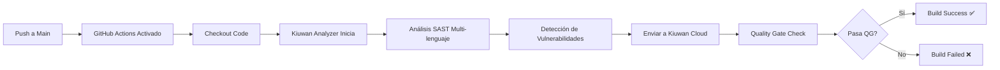

# 🔍 Kiuwan SAST Pipeline - Análisis de Código Estático Automatizado


Pipeline automatizado de **Static Application Security Testing (SAST)** integrado con **Kiuwan** mediante GitHub Actions. Este proyecto demuestra la integración de análisis de seguridad estático en workflows de CI/CD utilizando código intencionalmente vulnerable para testing.

## 📋 Tabla de Contenidos

- [Descripción General](#-descripción-general)
- [Características](#-características)
- [Cómo Funciona](#-cómo-funciona)
- [Arquitectura del Proyecto](#-arquitectura-del-proyecto)
- [Código Vulnerable de Ejemplo](#-código-vulnerable-de-ejemplo)
- [Requisitos Previos](#-requisitos-previos)
- [Configuración](#-configuración)
- [Uso](#-uso)
- [Visualización de Resultados](#-visualización-de-resultados)
- [Tecnologías Utilizadas](#️-tecnologías-utilizadas)
- [Consideraciones de Seguridad](#-consideraciones-de-seguridad)
- [Recursos Adicionales](#-recursos-adicionales)

---

## 🎯 Descripción General

Este repositorio implementa un **pipeline de CI/CD con SAST** utilizando **Kiuwan**, una plataforma de análisis de seguridad de código estático. El proyecto contiene código **intencionalmente vulnerable** en múltiples lenguajes para demostrar:

- Integración de SAST en GitHub Actions
- Detección automática de vulnerabilidades de seguridad
- Análisis multi-lenguaje (Java, JavaScript, Python, otros)
- Envío de resultados a Kiuwan Cloud

### 🚨 Propósito del Código Vulnerable

El código en este repositorio contiene **vulnerabilidades intencionales** con fines educativos y de demostración. **NUNCA** uses este código en producción.

---

## ✨ Características

- 🔄 **Análisis automatizado** en cada push o PR
- 🌐 **Multi-lenguaje**: Java, JavaScript, Python, entre otros.
- 🔍 **Kiuwan SAST** para análisis profundo de código
- ☁️ **Resultados en Kiuwan Cloud** para análisis detallado
- ⚙️ **GitHub Actions** integración CI/CD
- 🎯 **Código vulnerable de ejemplo** para testing
- 🛡️ **Security gates** configurables
- 📈 **Métricas de calidad** de código

---

## 🔄 Cómo Funciona


```mermaid
graph LR
    A[Push a Main] --> B[GitHub Actions Activado]
    B --> C[Checkout Code]
    C --> D[Kiuwan Analyzer Inicia]
    D --> E[Análisis SAST Multi-lenguaje]
    E --> F[Detección de Vulnerabilidades]
    F --> G[Enviar a Kiuwan Cloud]
    G --> H[Quality Gate Check]
    H --> I{Pasa QG?}
    I -->|Sí| J[Build Success ✅]
    I -->|No| K[Build Failed ❌]
```

### Flujo del Pipeline:

1. **Trigger**: Push, PR o ejecución manual
2. **Checkout**: Descarga el código fuente
3. **Setup**: Configura Kiuwan analyzer
4. **Análisis**: Escanea código en busca de vulnerabilidades
5. **Envío**: Los resultados se envían a **Kiuwan Cloud**
6. **Quality Gate**: Evalúa contra umbrales de seguridad
7. **Resultado**: Success/Failure basado en hallazgos

---

## 🏗️ Arquitectura del Proyecto

```
kiuwan-sast-pipeline/
├── .github/
│   └── workflows/
│       └── main.yml          # GitHub Actions workflow
├── src/
│   ├── VulnServlet.java      # Código vulnerable Java
│   ├── app-vuln.js           # Código vulnerable JavaScript
│   └── app_vuln_py.py        # Código vulnerable Python
├── README.md
├── LICENSE
└── .gitignore
```

---

## 💣 Código Vulnerable de Ejemplo

### Java - SQL Injection
```java
// VulnServlet.java - VULNERABLE
String query = "SELECT * FROM users WHERE id = " + userId;
statement.executeQuery(query); // ❌ SQL Injection
```

### JavaScript - Command Injection
```javascript
// app-vuln.js - VULNERABLE
const exec = require('child_process').exec;
exec('ls ' + userInput); // ❌ Command Injection
```

### Python - Path Traversal
```python
# app_vuln_py.py - VULNERABLE
file_path = "/data/" + user_file
open(file_path, 'r') # ❌ Path Traversal
```

> ⚠️ **Advertencia**: Estos ejemplos contienen vulnerabilidades reales. Solo para fines educativos.

---

## 📦 Requisitos Previos

- Cuenta de GitHub con Actions habilitado
- Cuenta de Kiuwan Cloud (trial o licencia)
- Credenciales de Kiuwan (username y password)
- Conocimiento básico de SAST y seguridad de aplicaciones

---

## ⚙️ Configuración

### Configurar Secrets en GitHub

Navega a `Settings > Secrets and variables > Actions` y agrega:

```
KIUWAN_USERNAME=tu_usuario_kiuwan
KIUWAN_PASSWORD=tu_password_kiuwan
```

---

## 🚀 Uso

### 1. Clonar el Repositorio

```bash
git clone https://github.com/jhneira-sol/kiuwan-sast-pipeline.git
cd kiuwan-sast-pipeline
```

### 2. Ejecutar via GitHub Actions

Simplemente haz push de cambios:

```bash
git add .
git commit -m "Test SAST analysis"
git push origin main
```

### 3. Monitorear Ejecución

- **GitHub Actions**: Ve a la pestaña Actions para ver el estado del análisis
- El workflow ejecutará el análisis y enviará los resultados a Kiuwan Cloud

---

## 📊 Visualización de Resultados

Los resultados del análisis SAST se envían automáticamente a **Kiuwan Cloud** donde puedes visualizar:

### Acceso al Portal:
1. Inicia sesión en [Kiuwan Cloud](https://www.kiuwan.com/)
2. Navega a tu aplicación/proyecto
3. Revisa los reportes generados con todas las vulnerabilidades detectadas

---

## 🛠️ Tecnologías Utilizadas

| Tecnología | Propósito |
|------------|----------|
| **Kiuwan Cloud** | Plataforma SAST para análisis de código |
| **GitHub Actions** | Automatización CI/CD |
| **Java** | Lenguaje vulnerable de ejemplo |
| **JavaScript (Node.js)** | Lenguaje vulnerable de ejemplo |
| **Python** | Lenguaje vulnerable de ejemplo |
| **OWASP** | Framework de referencia de seguridad |

---

## 🔐 Consideraciones de Seguridad

### ⚠️ IMPORTANTE:

- **NO** uses este código en producción
- **NO** expongas tus credenciales de Kiuwan
- **NO** hagas commit de secrets en el repositorio
- Este código es **únicamente para demostración y aprendizaje**

### Mejores Prácticas:

1. ✅ Usar GitHub Secrets para credenciales
2. ✅ Configurar quality gates apropiados
3. ✅ Revisar y remediar vulnerabilidades detectadas
4. ✅ Integrar SAST temprano en el SDLC
5. ✅ Combinar SAST con DAST para cobertura completa
6. ✅ Capacitar al equipo en secure coding

### Limitaciones del SAST:

- No detecta vulnerabilidades en runtime
- Puede generar falsos positivos
- Requiere configuración específica por lenguaje
- No reemplaza code reviews manuales

---

## 📚 Recursos Adicionales

- [Documentación Kiuwan](https://www.kiuwan.com/docs/)
- [OWASP Top 10](https://owasp.org/www-project-top-ten/)
- [CWE Top 25](https://cwe.mitre.org/top25/)
- [GitHub Actions Documentation](https://docs.github.com/es/actions)
- [SANS Top 25 Software Errors](https://www.sans.org/top25-software-errors/)
- [Secure Coding Practices](https://owasp.org/www-project-secure-coding-practices-quick-reference-guide/)

---

<div align="center">

**⭐ Si encuentras útil este proyecto, considera darle una estrella!**

**🔒 Recuerda: Este código es vulnerable por diseño - Solo para propósitos educativos**

</div>
